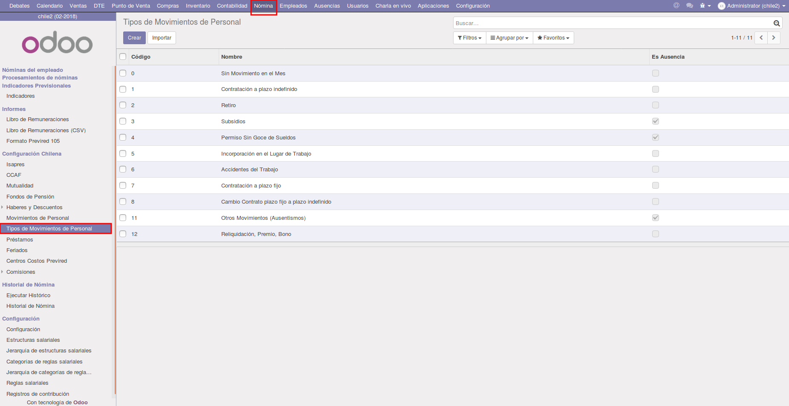
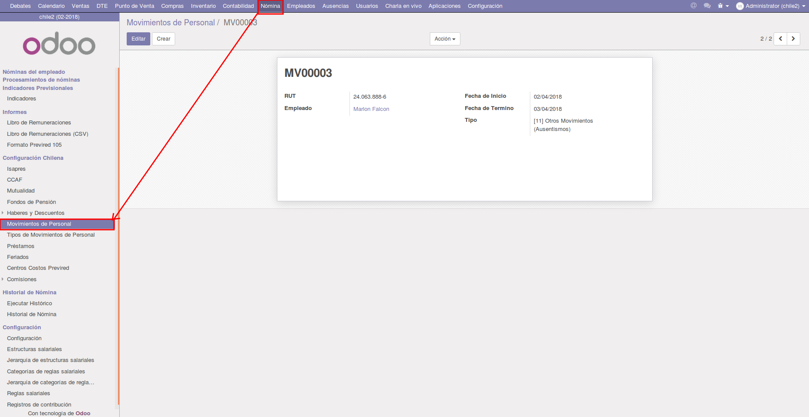
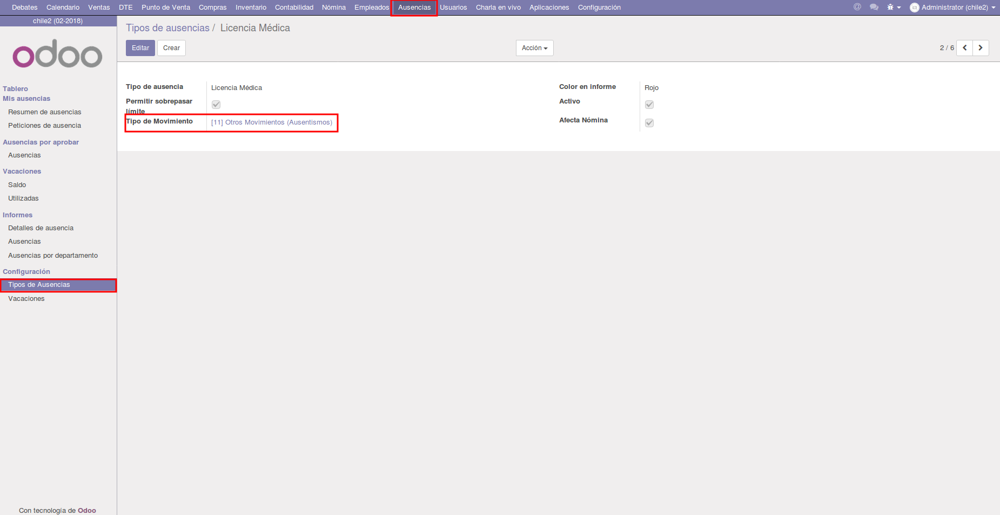

Movimientos de Personal
=======================

Estos registros guardan los diferentes movimientos de personal, utilizados para
el archivo de Previred. 

Configuración
-------------

Primeramente se deben configurar los Tipos de Movimientos de Personal, en el
menú ``Nómina > Configuración Chilena > Tipos de Movimientos de Personal``,
donde unicamente se podrá ver el listado y desde esa misma cargar nuevos tipos,
varios vienen pre-cargados en el sistema. Los campos a llenar son el **Nombre**,
**Código** y **Es Ausencia**, este último para ocultar los tipos de movimientos
del formulario, ya que estos tipos se deberían crear a partir de las ausencias.

Uso
---

Se pueden crear manualmente estos registros, yendo al menú ``Nómina >
Configuración Chilena > Movimientos de Personal``, y dando al botón **Crear**,
se desplegará el formulario donde debe llenar los siguientes datos:

#. **Empleado**: Empleado al que se le cargará el movimiento
#. **Fecha de Inicio**: Fecha desde cuando aplica el movimiento
#. **Fecha de Termino**: Fecha hasta la que es válido el movimiento
#. **Tipo**: Tipo de movimiento a registrar

El campo ``RUT`` se llena automáticamente al elegir el empleado, y luego de
guardar el movimiento de personal se le cargará como nombre un número de
secuencia con estilo MV#####

Carga de Ausencias
------------------

Se pueden configurar los tipos de ausencias para que al crear una petición de
estas, y luego de aprobarla, se cree automáticamente un Movimiento de Personal,
para ello se debe ir a ``Ausencias > Configuración > Tipos de Ausencia``, elegir
el tipo de ausencia a configurar y en el formulario llenar el campo ``Tipo de
Movimiento``, eligiendo el tipo de movimiento que queremos que se cree.

