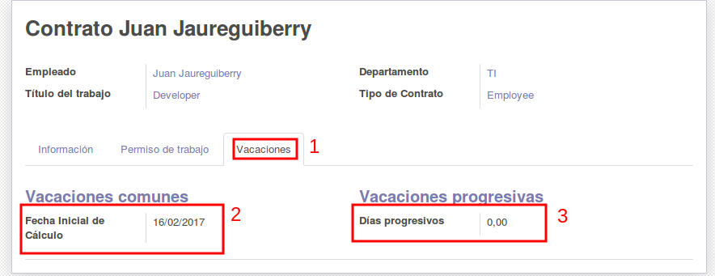

Módulo de Vacaciones
====================

El propósito de éste módulo es brindar una herramienta capaz de calcular los
días de vacaciones disponibles para los empleados, así como poder otorgar estos
días y llevar un seguimiento de los mismos.

Configuración Inicial
---------------------

El sistema requiere de 2 parámetros, los **Días de Vacaciones** y **Tiempo de Antigüedad**,
estos se deben configurar desde: ``Ausencias > Configuración > Vacaciones``, donde
además debe indicar la fecha desde la que serán válidas estas configuraciones.

1. **Días de Vacaciones**: Son los días que se otorgan anualmente a cada trabajador. Valor entero positivo.
2. **Tiempo de Antigüedad**: Tiempo que debe tener el trabajador para poder asignarle vacaciones, calculado en meses. Valor entero positivo.
3. **Válido desde**: Fecha desde la que esta configuración tendrá efecto.

.. image:: img/holidays_settings.png
   :alt: Configuración de Vacaciones
   :align: center
   :width: 100%

Una vez cargada al menos una configuración, se podrá activar el cron para que este
ejecute los cálculos diariamente y haga las asignaciones correspondientes, si no
se quiere esperar a que el cron haga los cálculos, se puede correr el proceso
manualmente desde cualquiera de los registros de configuración, haciendo click
en ``Calcular días``. El cron debe ser activado también desde cualquiera de las
configuraciones haciendo click en ``Activar cron`` y podrá ser desactivado con
el mismo botón.

El sistema evaluará los días pendientes de cada trabajador respecto a los días
que ya se les han asignado por concepto de vacaciones, y solo asignará los días
que calcule como pendientes. Solo puede haber un registro de Petición de Asignación
de tipo Vacaciones por trabajador, por lo que el sistema sobreescribirá el registro
anterior en caso de existir.

Cálculo de días de vacaciones
-----------------------------

El sistema se basará en la fecha de inicio del contrato del trabajador para determinar
cuantos días le corresponden según las configuraciones. Se realizan los siguientes cálculos:

1. Se calculan los ``meses_trabajando`` sacando la diferencia entre el día inicial del contrato y la fecha actual del sistema (hoy)
2. Se verifican los ``dias_otorgados`` previamente de vacaciones, para restarlos al total calculado
3. Suponiendo que ``dias_de_vacaciones`` son los días que se configurarón previamente en el sistema, los ``dias_acumulados`` que lleva el trabajador serían ``dias_de_vacaciones / 12 * meses_trabajando``
4. Los ``dias_acumulados`` representan los días que ha acumulado desde el inicio de la relación laboral, pero tomando en cuenta las diferentes configuraciones cargadas en el sistema, pudiendo cargar 15 días el primer año, 20 días el año siguiente, y así sucesivamente

Ya que un trabajador puede tener mas de 1 contrato con la empresa, sea porque fue movido de puesto o cualquier circunstancia, la fecha de inicio del contrato actual quizás no refleje la verdadera fecha de inicio de la relación laboral, por lo que se puede configurar adicionalmente la fecha de inicio para el cálculo directamente en el contrato del trabajador, si esta no se indica, se tomará la fecha de inicio del contrato. También se puede configurar en el contrato los días progresivos de vacaciones que puede acumular el trabajador, si es que los puede pedir, indicando cuantos días le corresponden. Estos días que se carguen acá serán consumidos automáticamente por el cron y se agregarán a sus días de vacaciones progresivas disponibles, y este campo volverá a estar en 0 hasta que se cargue manualmente mas días.

Uso
---

Las vacaciones en el sistema son tratadas como otro tipo de ausencia, y las mismas
se manejan en 2 tipos:

* Petición de Asignación: Estas indican cuantos días se le puede asignar a un trabajador, será el disponible, y debe ser cargado primeramente por un encargado.
* Petición de Ausencia: Estas indican que un trabajador estará afuera, por cuanto tiempo y qué días, consumiendo de sus días disponibles cargados previamente.

Las peticiones de asignación para vacaciones las carga el sistema automáticamente,
por lo que estas no se deberían cargar una a una manualmente, a menos que se requiera
hacer una corrección por alguna causa excepcional. Sabiendo esto, nos limitaremos
a cargar solamente los días que el trabajador a pedido para disfrutar sus vacaciones.

1. Nos dirigimos a ``Ausencias > Mis Ausencias > Peticiones de Ausencia``, veremos la vista de calendario con las filtradas del usuario conectado, para verlas todas, quitamos del filtro ``Mis Peticiones``. Podremos también ver las peticiones en la vista de listado para una mejor comprensión.

  .. image:: img/holidays_list.png
     :alt: Listado de Ausencias
     :align: center
     :width: 100%

2. Si está en la vista calendario, se debe tocar el cuadro del día inicial y sin soltar deslizamos hasta el cuadro del día final. En la vista de listado solo se debe dar al botón ``Crear``.
3. Se abrirá el formulario para llenar los datos de las vacaciones, como el sistema está pensado para que cada empleado solicite por su cuenta las vacaciones, estas cargan por defecto el empleado asociado al usuario que está conectado, donde luego queda en un estado ``Para aprobar``, donde un encargado debe aprobarlas para que el sistema las tome como válidas. Si es un encargado el que cargará las vacaciones de los empleados, lo primero que debe hacer es elegir al empleado, luego marcar en el tipo de ausencias "Vacaciones", y por último indicar la fecha de salida y de regreso. El sistema automáticamente calcula los días que estará afuera (y que serán descontados de sus días disponibles) pero estos días se pueden editar manualmente si fuese necesario.

  .. image:: img/vacation_load.png
     :alt: Carga de vacaciones
     :align: center
     :width: 100%

4. Una vez cargados los datos requeridos, se procede a guardar la petición para luego aprobarla. Hasta que no se aprueben, estas vacaciones no son válidas y no tendrán efecto alguno en los cálculos que haga el sistema.
