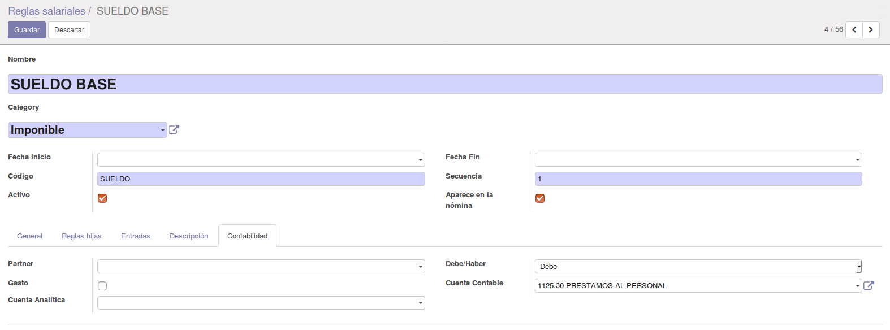
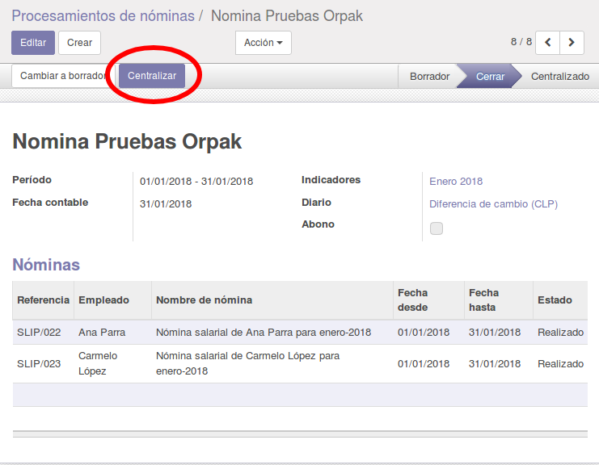
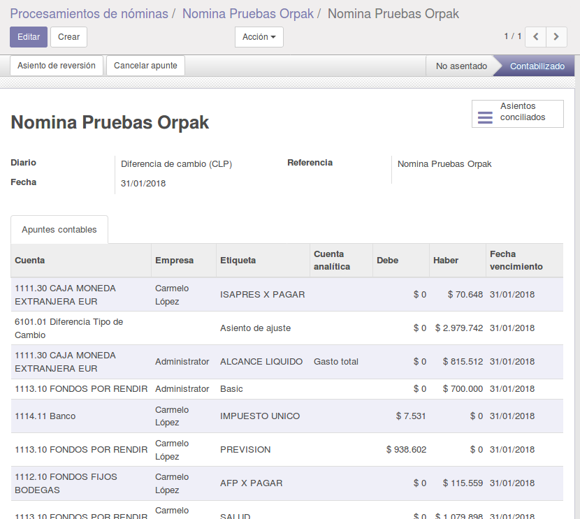
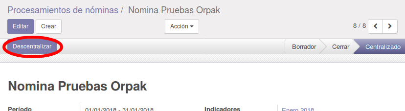

Contabilidad en Nómina MFH
==========================

Cree los asientos contables a partir de un proceso de nómina de los empleados

Configuración
-------------

Se deben configurar las reglas salariales que se mostrarán en el asiento, estas
son tomadas de las nóminas de los empleados según la estructura salarial que
tengan en sus contratos. Se debe ir a la pestaña Contabilidad en la vista de las
reglas salariales para configurar los campos:

- **Partner**: éste será reflejado en el apunte del asiento, en caso de dejarlo en blanco, se tomará al empleado.
- **Debe/Haber**: Se debe indicar el tipo de cuenta, si será reflejado por Debe o por Haber en el apunte contable.
- **Cuenta Contable**: Requerido para indicar en el apunte la cuenta a tomar.
- **Gasto**: Si se marca, se tomará la cuenta analítica en el contrato del empleado, a menos que haya un partner seleccionado en la regla salarial.

Uso
---

Una vez creado el proceso de nómina, y luego de haber generado las nóminas que
se van a pagar, se debe cerrar la misma (dejar en estado Cerrado) para que se
habilite el botón **Centralizar** en la cabecera del documento. Se deberá
indicar dentro del proceso cual será el **Diario** y la **Fecha Contable** para
poder centralizar las nóminas. Al pulsar el botón **Centralizar** se correrá el
proceso interno donde se agruparán las reglas salariales y se crearán los
apuntes contables dentro del asiento contable, y el proceso de nómina pasará a
estado **Centralizado**, donde se habilitará un campo **Asiento** que enlazará
al asiento contable recién creado.

Este proceso puede ser reversado, una vez centralizadas las nóminas y el proceso
se muestre en estado **Centralizado**, se habilitará un botón en la cabecera del
documento del proceso **Descentralizar**, con el cual se podrá devolver el mismo
a estado **Cerrado** y se borrará el asiento contable, esto con el fin de hacer
correcciones a las nóminas de ser necesario.

Maintainer
----------

.. image:: http://falconsolutions.cl/wp-content/uploads/2017/02/fs-1.png
   :alt: Falcon Solutions SpA
   :target: http://www.falconsolutions.cl

This module is maintained by Falcon Solutions SpA.
